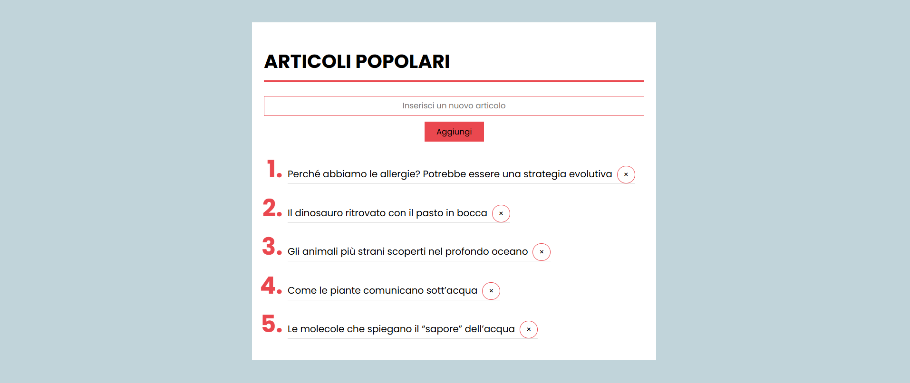

# react-form

## 🇬🇧 English Version

### Overview

React exercise focused on rendering a list of blog posts and updating it through a controlled form.

### Assignment Summary

The assignment required to:

- Create a page that displays a list of blog articles, initially showing only their titles.
- Add a simple form with an input field to enter the title of a new blog article.
- Update and re-render the list of articles when the form is submitted, including the newly added title.

---

## 🇮🇹 Versione Italiana

### Panoramica

Esercizio React dedicato alla visualizzazione di una lista di articoli di blog e al suo aggiornamento tramite un form controllato.

### Riassunto della Consegna

La consegna richiedeva di:

- Creare una pagina che mostri una lista di articoli del blog, visualizzando inizialmente solo i titoli.
- Aggiungere un semplice form con un campo di input per inserire il titolo di un nuovo articolo.
- Aggiornare e ristampare la lista degli articoli al submit del form, includendo il nuovo titolo inserito.
